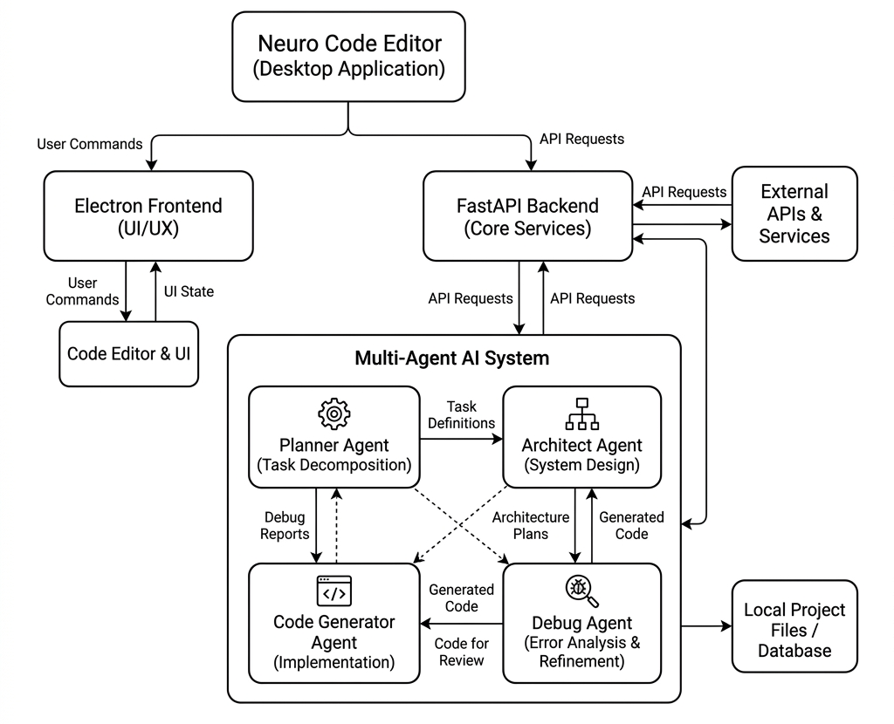
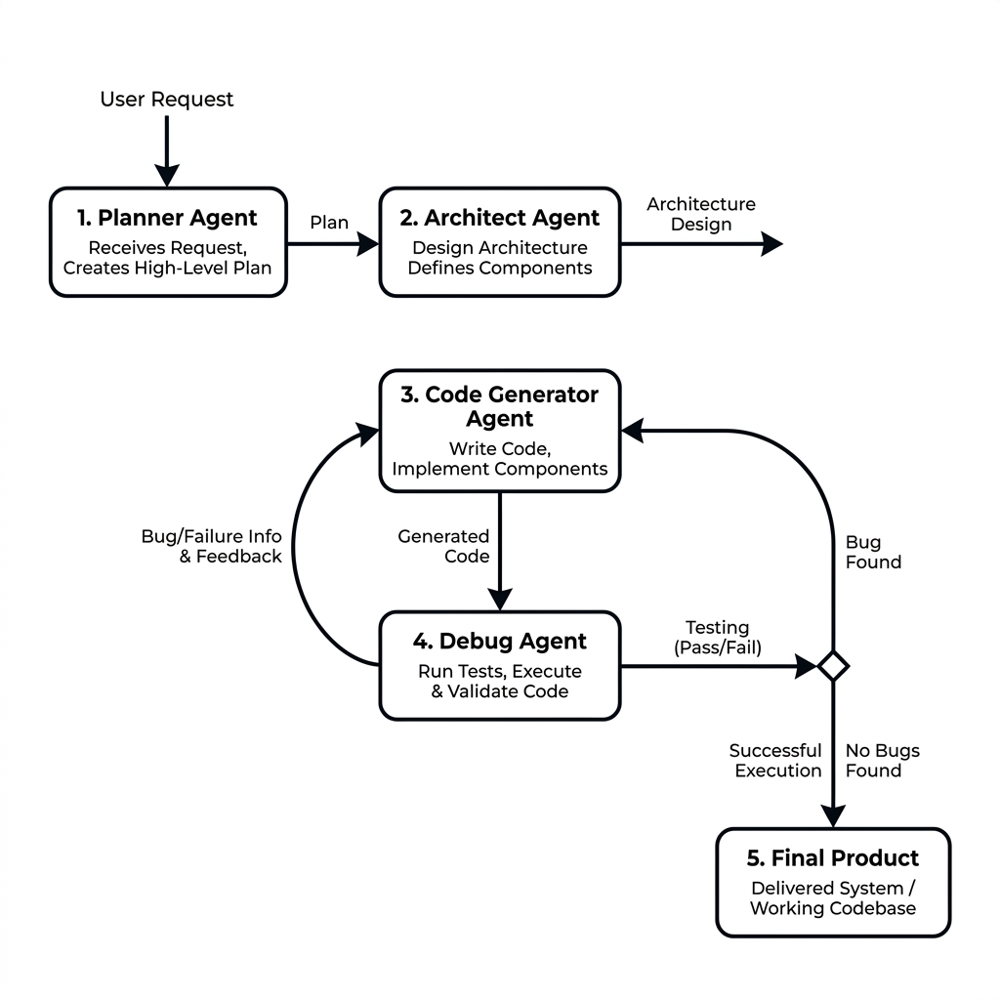

# PROPOSED SYSTEM

The Multi Agentic AI Automation system is designed to overcome the limitations of traditional AI coding assistants by introducing a hybrid architecture that combines desktop-native flexibility with AI-native performance and intelligent multi-agent orchestration. This section details the architecture, individual modules, and the innovative features that define the system.

## 3.1 OVERVIEW OF PROJECT

The proposed system follows a modular architecture where the frontend (Electron), the AI orchestration layer (FastAPI), and local file system access are decoupled but highly synchronized. The core innovation lies in the **Intelligent Agentic Synthesis Pipeline**, which treats a user's query not as a single text prompt, but as a dynamic, intent-driven architectural planning and code generation task.

The system workflow follows these high-level stages:
1.  **Intent Parsing**: Utilizing the Planner Agent to identify the user's software output requirement and determine project complexity.
2.  **AI Orchestration**: The Orchestrator routes the query to the appropriate agentic sequence (Planner -> Architect -> Code Gen -> Debug).
3.  **Schema-Based Generation**: Each agent's output is processed using a strict Pydantic schema to ensure perfectly structured JSON execution plans and code components.
4.  **Local File Rendering**: The structured JSON code output is instantly rendered as interactive Monaco Editor components or exported securely to the local file system.
5.  **Quality Assurance**: The generated code undergoes a validation loop by the Debug Agent to ensure syntax correctness before final deployment.

## 3.2 SYSTEM COMPONENTS

The Multi Agentic AI Automation system consists of four primary components, each designed for high efficiency and local execution scalability.

### 3.2.1 Electron + React Frontend (Desktop Application)
The frontend is the user's primary interface for all coding interactions. It is built using **Electron and React** to ensure a high-performance, native rendering engine across all desktop environments.
   **State Management**: Uses **React State** and custom hooks for reactive UI updates and managing complex IDE and editor states.
   **Code Renderer**: A custom Monaco Editor integration that handles syntax highlighting, code folding, and multi-file workspace views.
   **Input Capture**: Captures user text input, project requirements, and special operational triggers for agentic reasoning.
   **File Export Engine**: Supports high-fidelity file creation, deletion, and directory structuring directly on the local machine using Node.js filesystem bridges.

### 3.2.2 FastAPI Agent Orchestration Server (The Backend)
The backend server is orchestrated using **FastAPI** to take advantage of its excellent async architecture and structured Python typing capabilities.
   **Agent Pipelines**: Acts as a high-speed orchestrator for planning, architecture, code generation, and debugging flows, each with its own Pydantic schema for output validation.
   **OpenRouter Integration**: Activates advanced LLMs (like Qwen) for sub-second inference when handling complex software logic tasks.
   **Local Execution Security**: Handles local cross-origin resource sharing (CORS), secure endpoint exposition, and API access control.
   **File Payload Layer**: Uses strict validation schemas to process multi-file JSON responses before dispatching them to the frontend.

### 3.2.3 AI Agent System (Logic-Side Implementation)
The Agent System is the "brain" of the application, handling the abstract logic conversion into concrete software files.
   **Planner Engine**: Analyzes abstract goals to produce step-by-step logic requirements.
   **Architect Engine**: Designs the system folder structure and separates concerns into logical files (e.g., HTML, CSS, JS).
   **Generator Engine**: Outputs the actual programming syntax adhering precisely to the Architect's blueprint.

## 3.3 FEATURES OF PROPOSED SYSTEM

The Multi Agentic AI Automation system introduces several groundbreaking features that set it apart from conventional AI coding solutions. These features focus on high performance, multi-agent structure, and an enhanced developer experience.

### 3.3.1 Multi-Agent AI Architecture
Multi Agentic AI Automation utilizes a unique sequential AI processing strategy to balance depth and speed:
   **Architectural Planning Path**: Leveraged for deep structural tasks such as generating entire React repositories, backend APIs, and multi-component applications. This ensures that complex logic is never lumped into a single monolithic script.
   **Code Debugging Path**: A custom-engineered validation flow designed for the analytical breakdown of code issues. By applying step-by-step logic, the system achieves near-human review capabilities for algorithmic correctness.

### 3.3.2 Intelligent "Intent-Based" Project Synthesis
Unlike traditional coding chats that produce the same plain markdown for every query, Multi Agentic AI Automation uses a high-performance orchestration algorithm to determine the scope of generation in real-time.
   **Selective Structuring**: The system identifies whether a query requires a single script or an entire folder scaffolding, and automatically applies the appropriate response structure.
   **Time Conservation**: By delegating distinct roles to distinct agents, the pipeline prevents cognitive overload on the LLM, reducing hallucination rates and preserving quality.

### 3.3.3 Interactive AI Panel & Code Generation
Multi Agentic AI Automation provides a robust mechanism for codebase creation and iteration:
   **High-Fidelity Code Engine**: The system integrates directly with **Monaco Editor** to generate fully syntax-highlighted code files, displaying diffs and execution plans intuitively.
   **Live Workspace Review**: A real-time file explorer lets users review and iterate on the generated file tree before accepting changes.

### 3.3.4 Developer-Grade System Integration
Designed for local, secure software development, Multi Agentic AI Automation offers robust desktop tooling:
   **Node.js IPC Bridge**: Securely maps browser-based actions to local operating system file manipulations without exposing arbitrary command execution to the web context.
   **Sandboxed Environment**: Supports secure execution and reading of code files, ensuring the AI only interacts with intended workspace directories.
   **Local Hosting API**: Administrators and users can easily run the lightweight Python API on `localhost`, preventing data leakage to external, untrusted web servers.

### 3.3.5 Integrated Workspace & Project Flow
Multi Agentic AI Automation treats file intelligence as a first-class citizen of the coding experience:
   **Modular Processing**: Large software architectures are split into small, manageable generation fragments (e.g., generating CSS separately from JS) to ensure processing stability.
   **Intuitive Workflow**: Features a robust "Prompt -> Plan -> Generate -> Write" mechanism that rapidly bridges the gap between abstract thought and executable software.

### 3.3.6 Dynamic Debugging & Quality Analytics
The system implements an **Adaptive Review Logic** to maintain code quality:
   **Validation Checks**: The Debug agent monitors the generator's output, automatically identifying common pitfalls like syntax errors or logical inconsistencies before presenting the result.
   **Developer Override**: Programmers can manually edit the generated code in the Monaco editor to quickly fix edge cases that the AI might have missed.

### 3.3.7 Workspace Personalization & Aesthetics
To make every coding session feel professional, Multi Agentic AI Automation includes modern IDE aesthetics:
   **VS Code Theme Synchronization**: The system uses industry-standard dark themes (#1e1e1e) and syntax coloring, creating a comfortable visual workspace.
   **Native UI Design**: Supports advanced desktop components (File Trees, Side Panels, and Resizable views) that respond to developer interactions seamlessly.

### 3.3.8 Infrastructure & Logic Management
For developers, Multi Agentic AI Automation provides tools to maintain the health of the entire pipeline:
   **Step-by-Step Visualization**: A centralized Agentic Panel that allows users to see exactly what each agent (Planner, Architect, etc.) is currently thinking and producing.
   **Atomic File Control**: Facilitates secure, local filesystem reads/writes for real-time synchronization between the code editor and the underlying OS.

## 3.4 ADVANTAGE OF THIS SYSTEM

1.  **Context Precision**: Multi-agent pipelines provide significantly better logical accuracy for large, multi-file codebases.
2.  **Time Efficiency**: Up to 80% reduction in time spent manually creating files, writing boilerplate, and connecting modules.
3.  **Cross-Platform Parity**: Identical feature set across Windows, macOS, and Linux thanks to Electron.
4.  **Security**: Full support for local execution with clear API boundaries and sandboxed IPC filesystem interactions.

## 3.5 ARCHITECTURE DIAGRAM

{section break}
