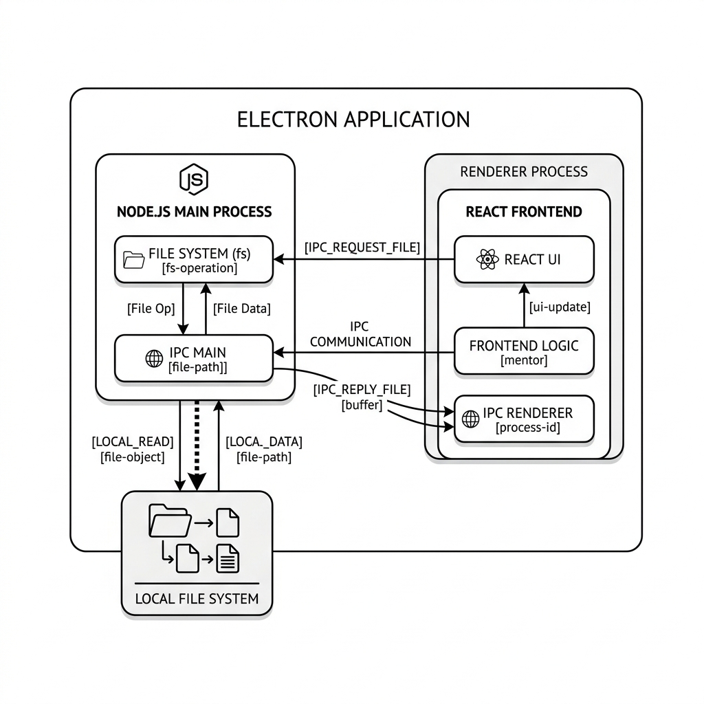

# CODE IMPLEMENTATION DEEP-DIVE

This chapter provides a detailed analysis of the core implementation logic across the primary layers of Multi Agentic AI Automation: the React Frontend, the FastAPI Agent Server, and the Electron Desktop environment.

## 6.1 REACT: EDITOR & AGENTIC INTERFACE LOGIC

The `AgenticPanel` and `CodeEditor` components handle complex AI intent rendering and source code synchronization.

### 6.1.1 Advanced Code Rendering & Diffs
The system uses the Monaco Editor library to parse generated syntax and map it to VS Code language definitions based on the requested file extensions.

```javascript
// Monaco Editor Integration Logic
function CodeDiffViewer({ originalCode, generatedCode, language }) {
  return (
    <MonacoDiffEditor
      height="400px"
      language={language}
      original={originalCode}
      modified={generatedCode}
      theme="vs-dark"
      options={{ readOnly: true, minimap: { enabled: false } }}
    />
  );
}
```

### 6.1.2 Dynamic Agent Step Visualization
Multi Agentic AI Automation supports sequential rendering modes depending on the current active agent:

1.  **Thinking State (Planner)**: Used to display the chain-of-thought logic in a lightweight text panel while the LLM determines requirements.
2.  **Structural View (Architect)**: The system renders a visual folder-tree preview of the proposed architecture before a single line of code is written.
3.  **Code Output (Generator)**: Displays the final synthesized code components in a tabbed editor view, allowing the developer to review and selectively accept file changes.

```javascript
// Step execution UI logic
function AgentStepsView({ status, plan, architecture }) {
  if (status === 'planning') return <Spinner text="Planner Agent Analyzing..." />;
  if (status === 'architecting') return <TreeView data={architecture.directories} />;
  return <CodePreview tabs={architecture.files} />;
}
```

### 6.1.3 Agentic Pipeline Scaling
The backend logic adjusts the LLM parameters dynamically based on the complexity of the file.

```python
class AgentComplexity(str, Enum):
    snippet = "snippet"         # localized algorithm logic
    component = "component"     # Single React/UI element
    module = "module"           # Multi-file feature
    project = "project"         # Full repository generation
```

## 6.2 ELECTRON: DESKTOP SYSTEM & IPC

The `preload.js` script acts as a secure membrane, filtering interactions between the React app and the Node.js backend system.

### 6.2.1 Secure IPC Context Bridge
```javascript
const { contextBridge, ipcRenderer } = require('electron');

contextBridge.exposeInMainWorld('electronAPI', {
  readFile: (filePath) => ipcRenderer.invoke('read-file', filePath),
  writeFile: (filePath, content) => ipcRenderer.invoke('write-file', filePath, content),
  readDir: (dirPath) => ipcRenderer.invoke('read-dir', dirPath),
});
```

### 6.2.2 File System Management (Write/Sync)
The user can trigger a "Write to Disk" operation which takes the structured Agent output and commits it to the local operating system directory.

```javascript
async function writeGeneratedFiles(baseDir, files) {
  for (const file of files) {
    const fullPath = path.join(baseDir, file.filename);
    await fs.promises.mkdir(path.dirname(fullPath), { recursive: true });
    await fs.promises.writeFile(fullPath, file.content, 'utf8');
  }
}
```

## 6.3 FASTAPI: MULTI-AGENT ORCHESTRATION BACKEND

The Python server implements several structured AI agents for comprehensive codebase generation.

### 6.3.1 Architect Agent Schema Management
Architecture requests are treated as strictly typed tasks with Pydantic-enforced JSON validation.

```python
class ArchitectAgent:
    def __init__(self, llm_client):
        self.llm = llm_client
        self.system_prompt = "You are an expert Software Architect."
        
    def generate_structure(self, user_plan: str) -> ArchitecturePlan:
        # Calls the OpenRouter model with strict Pydantic parsing
        raw_json = self.llm.query(self.system_prompt, user_plan)
        return ArchitecturePlan.parse_raw(raw_json)
```

## 6.4 IPC & FILE TRANSFER PROTOCOL

The application architecture utilizes Electron's IPC (Inter-Process Communication) to pass file chunks and metadata between the Node.js main thread and the React rendering thread securely, ensuring UI responsiveness even during heavy workspace scans.



{section break}
