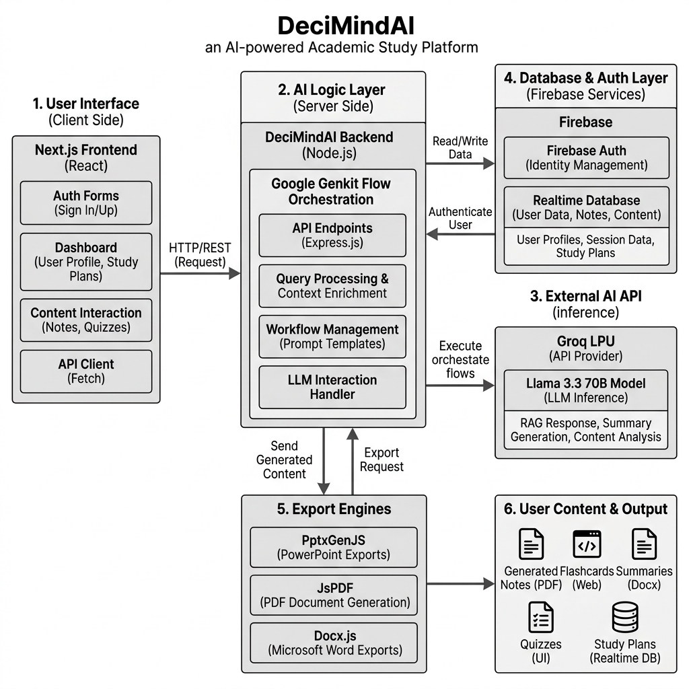

# PROPOSED SYSTEM

The DeciMindAI system is designed to overcome the limitations of traditional AI productivity tools by introducing a hybrid architecture that combines cross-platform web flexibility with AI-native performance and intelligent academic structuring. This section details the architecture, individual modules, and the innovative features that define the system.

## 3.1 OVERVIEW OF PROJECT

The proposed system follows a modular architecture where the frontend, AI orchestration layer, and cloud database are decoupled but highly synchronized. The core innovation lies in the **Intelligent Academic Synthesis Pipeline**, which treats a user's query not as a single text prompt, but as a dynamic intent-driven academic content generation task.

The system workflow follows these high-level stages:
1.  **Intent Parsing**: Utilizing structured prompt wrappers (e.g., `[Study:]`, `[Think:]`, `[PPT:]`) to identify the user's academic output requirement.
2.  **AI Orchestration**: The system routes the query to the appropriate Genkit Flow for processing and structured JSON generation.
3.  **Schema-Based Generation**: Each query type is processed using a validated Zod schema to ensure perfectly structured AI output.
4.  **Document Rendering**: The structured JSON output is instantly rendered as interactive UI components or exported to PPTX, PDF, or DOCX formats.
5.  **Cloud Synchronization**: All sessions and messages are persisted to Firebase Realtime Database for cross-device access and review.

## 3.2 SYSTEM COMPONENTS

The DeciMindAI system consists of four primary components, each designed for high efficiency and academic scalability.

### 3.2.1 Next.js Frontend (Client-Side Application)
The frontend is the user's primary interface for all academic interactions. It is built using **Next.js 15** with the App Router to ensure a high-performance, server-side rendering engine across all desktop and mobile browsers.
   **State Management**: Uses **React Context** and custom hooks for reactive UI updates and managing complex chat and session states.
   **Chat Renderer**: A custom logic module that handles structured AI message rendering, including academic sections, comparison tables, and process flow diagrams.
   **Input Capture**: Captures user text input, uploaded files (images, PDFs), and special mode triggers (`[Study:]`, `[Think:]`, `[Quiz:]`, `[PPT:]`).
   **Document Export Engine**: Supports high-fidelity document export using PptxGenJS, JsPDF, and Docx.js directly from the browser.

### 3.2.2 Genkit AI Orchestration Server (The Backbone)
The AI server is orchestrated using **Google Genkit** to take advantage of its excellent flow-based architecture and structured data generation capabilities.
   **Genkit Flows**: Acts as a high-speed orchestrator for chat, study, think, PPT, and quiz generation flows, each with its own Zod schema for output validation.
   **Groq LPU™ Integration**: Activates Groq's Language Processing Unit for sub-second inference when handling complex academic reasoning tasks.
   **Identity & Security**: Handles Firebase JWT token validation, user session management, and API endpoint access control.
   **Persistence Layer**: Uses **Firebase Realtime Database** for storing user chat histories, message metadata, PPT data, and quiz results.

### 3.2.3 OCR & Multimodal Processing (Input-Side Implementation)
The Multimodal Hub is the "sense organ" of the system, handling non-text academic inputs.
   **OCR Engine**: Uses the **OCR.space API** for extracting text from handwritten notes, textbook images, and scanned documents.
   **PDF Parser**: Implements the `pdf-parse` library for ingesting and summarizing large academic PDFs, with content chunking for Groq's token limits.
   **Image Intelligence**: Analyzes uploaded content to automatically suggest relevant study topics or quiz questions based on extracted text.

## 3.3 FEATURES OF PROPOSED SYSTEM

The DeciMindAI system introduces several groundbreaking features that set it apart from conventional AI productivity solutions. These features focus on high performance, academic structure, and an enhanced user experience.

### 3.3.1 Dual-Mode AI Architecture
DeciMindAI utilizes a unique parallel AI processing strategy to balance depth and speed:
   **Study Mode Path**: Leveraged for deep academic tasks such as generating "13-mark" university answers, structured essays, and topic summaries with embedded comparison tables. This ensures that complex academic content is never oversimplified.
   **Think Mode Path**: A custom-engineered chain-of-thought reasoning flow designed for the analytical breakdown of complex problems. By applying step-by-step logic, the system achieves near-human reasoning for mathematical proofs and system design questions.

### 3.3.2 Intelligent "Intent-Based" Response Synthesis
Unlike traditional systems that produce the same format for every query, DeciMindAI uses a high-performance intent classification algorithm to detect the academic context in real-time.
   **Selective Structuring**: The system identifies specific queries requiring academic formatting (e.g., exam-style questions) and automatically applies the appropriate response structure.

### 3.3.3 Interactive PPT Generation & Session Recording
DeciMindAI provides a robust mechanism for presentation creation and academic content review:
   **High-Fidelity Generation**: The system integrates directly with **PptxGenJS** to generate fully editable `.pptx` files from AI-structured content, including slide titles, bullet points, and image keyword suggestions.
   **Web Preview**: A live carousel-based slide preview powered by **Embla Carousel** lets users review and iterate on presentations before downloading.

### 3.3.4 Enterprise-Grade Academic Administration
Designed for large-scale educational deployments, DeciMindAI offers sophisticated management tools:
   **Firebase Auth Integration**: Trusted devices can establish an authorized session using Firebase Google Sign-In, allowing for instant, one-click access without manual credential entry.
   **Role-Based Access Control (RBAC)**: Supports complex permission hierarchies including **Student**, **Educator**, **Researcher**, and **Administrator** roles, each with varying levels of feature visibility.
   **Session Matrix**: Administrators can define exactly which users are allowed to access specific advanced features, complete with usage tracking and detailed session audit logs.

### 3.3.5 Integrated OCR & Document Workflow
DeciMindAI treats document intelligence as a first-class citizen of the academic experience:
   **Chunked Processing**: Large PDF documents are split into small, manageable text fragments to ensure processing stability and within-token-limit summarization.
   **Intuitive Workflow**: Features a robust "Upload → Extract → Study" mechanism that quickly bridges the gap between physical academic materials and AI-powered learning.

### 3.3.6 Dynamic Quiz Engine & Visual Analytics
The system implements an **Adaptive Assessment Logic** similar to modern e-learning platforms (e.g., Coursera):
   **Real-time Adaptation**: The quiz engine monitors student performance, automatically adjusting difficulty between "Easy," "Medium," and "Hard" question sets to prevent cognitive overload.
   **Manual Override**: Educators can manually lock quiz parameters to specific difficulty levels and question counts to suit their specific assessment requirements.

### 3.3.7 Workspace Personalization & Aesthetics
To make every study session feel as engaging and premium as possible, DeciMindAI includes deep aesthetic customization:
   **Chat Wallpaper Synchronization**: The system allows users to personalize their chat background, creating a visually personalized study workspace.
   **Native Theme Engine**: Supports advanced UI themes (Light, Dark, and Glassmorphism) that respond to system settings, ensuring a premium, professional feel.

### 3.3.8 Infrastructure & Database Management
For academic administrators, DeciMindAI provides tools to maintain the health of the entire platform:
   **Session Export**: A centralized export system that allows users to download their full chat history as structured PDF or DOCX reports for offline review.
   **Atomic Firebase Control**: Facilitates secure, encrypted database reads/writes for real-time chat sync and rapid cross-device session recovery.

## 3.4 ADVANTAGE OF THIS SYSTEM

1.  **Latency Reduction**: Sub-2-second AI response time for a "seamless" academic interaction feel.
2.  **Time Efficiency**: Up to 80% reduction in time spent manually formatting AI responses into academic documents.
3.  **Cross-Platform Parity**: Identical feature set across Windows, macOS, Linux, and Mobile browsers.
4.  **Privacy**: Full support for Firebase-secured user data with zero-knowledge AI inference via Groq Cloud.

## 3.5 ARCHITECTURE DIAGRAM

### Academic Synthesis State Logic

{section break}