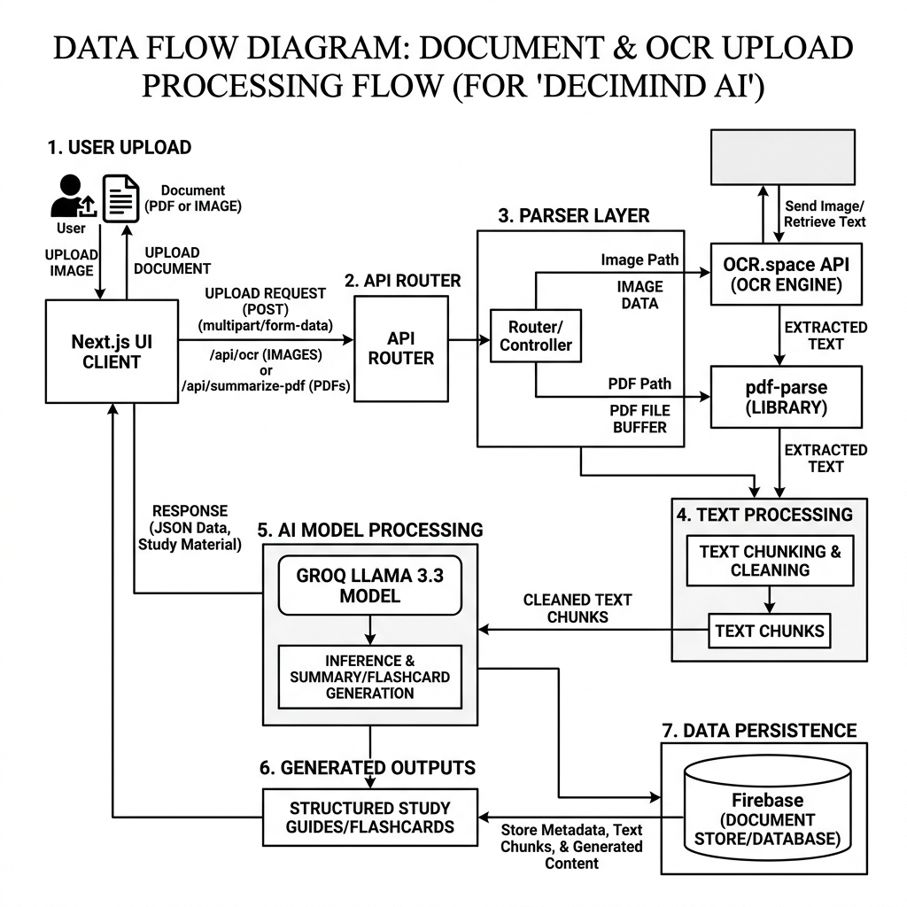

# CODE IMPLEMENTATION DEEP-DIVE

This chapter provides a detailed analysis of the core implementation logic across the primary layers of DeciMindAI: the Next.js Frontend, the Genkit AI Server, and the Firebase Cloud Backend.

## 6.1 NEXT.JS: CHAT INTERFACE LOGIC

The `ChatInterface` component handles complex AI message rendering and academic content synchronization.

### 6.1.1 Advanced Academic Markdown Rendering
The system uses a custom `AcademicRenderer` to parse structured AI JSON responses and normalize academic sections based on the Zod-validated output schema.

```typescript
// Academic content mapping logic
function renderStudySection(section: StudySection): React.ReactNode {
  const headingLevel = section.type === 'main' ? 'h2' : 'h3';
  const contentStyle = section.isNumbered ? 'numbered-list' : 'prose';
  return <Section heading={section.heading} style={contentStyle} level={headingLevel} />;
}
```

### 6.1.2 Dynamic PPT Slide Preview
DeciMindAI supports two rendering modes depending on the output type:

1.  **Embla Carousel Preview**: Used in the browser to render AI-generated slides as an interactive, swipeable carousel with live Zod-validated slide data.
2.  **PptxGenJS Export**: On all platforms, the system triggers a client-side `pptxgenjs` render to export the session as a fully editable `.pptx` file with proper fonts, layouts, and image placeholders.

```typescript
// PPT export command example
async function exportToPptx(slides: Slide[]): Promise<void> {
  const pptx = new PptxGenJS();
  slides.forEach(slide => {
    const s = pptx.addSlide();
    s.addText(slide.title, { fontSize: 28, bold: true, color: '363636' });
    slide.bullets.forEach((b, i) => s.addText(`• ${b}`, { y: 1.5 + i * 0.4, fontSize: 14 }));
  });
  await pptx.writeFile({ fileName: 'DeciMindAI_Presentation.pptx' });
}
```

### 6.1.3 Groq-like Quality Scaling
The `AIChatMode` logic adjusts the Genkit flow and Groq model parameters dynamically.

```typescript
enum AIChatMode {
  study,      // Structured 13-mark academic output
  think,      // Chain-of-thought deep reasoning
  standard,   // Balanced chat response
  quiz        // Assessment engine with scoring
}
```

## 6.2 NEXT.JS: SETTINGS & ADMINISTRATION

The `SettingsPage` is a multi-section interface that adapts its content based on the user's Firebase Auth role.

### 6.2.1 Role-Based Visibility
```typescript
function canAccessAdvancedFeatures(user: FirebaseUser): boolean {
  return user.role === 'educator' || user.role === 'administrator';
}
```

### 6.2.2 Chat History Management (Export/Restore)
The user can trigger a full chat history export which generates a structured PDF from the Firebase message data.

```typescript
async function exportChatHistory(chatId: string): Promise<void> {
  const messagesRef = ref(db, `chats/${userId}/${chatId}/messages`);
  const snapshot = await get(messagesRef);
  const messages = Object.values(snapshot.val() || {});
  const doc = generatePdfFromMessages(messages);
  doc.save(`DeciMindAI_Chat_${chatId}.pdf`);
}
```

## 6.3 GENKIT: AI ORCHESTRATION BACKEND

The Genkit server implements several structured AI flows for academic content generation.

### 6.3.1 Study Flow Schema Management
Study queries are treated as structured academic tasks with a Zod-enforced output schema.

```typescript
export const studyChatFlow = ai.defineFlow(
  { name: 'studyChatFlow', inputSchema: z.string(), outputSchema: studyOutputSchema },
  async (userQuery) => {
    const { output } = await ai.generate({
      model: groq('llama-3.3-70b-versatile'),
      prompt: buildStudyPrompt(userQuery),
      output: { schema: studyOutputSchema },
    });
    return output!;
  }
);
```

## 6.4 FILE TRANSFER PROTOCOL

The document upload system uses the Next.js API route for small text extractions and metadata, while large PDF documents are chunked into 4000-token fragments to prevent blocking the AI inference path.



{section break}