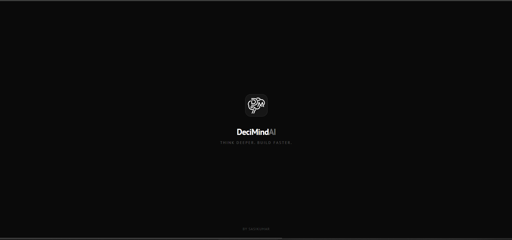
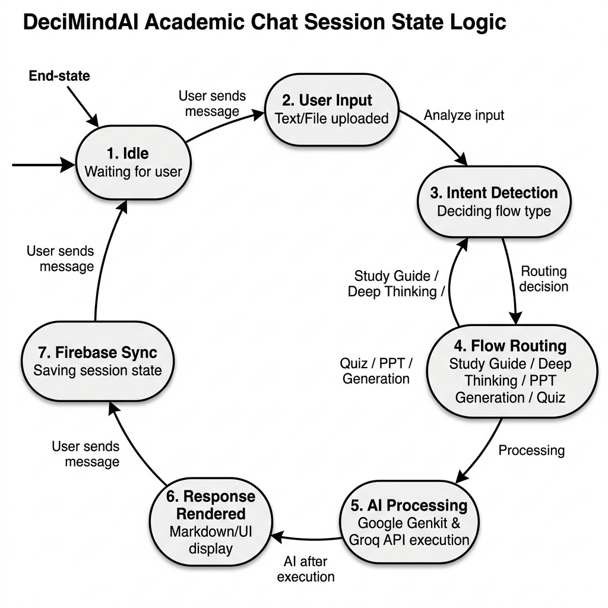
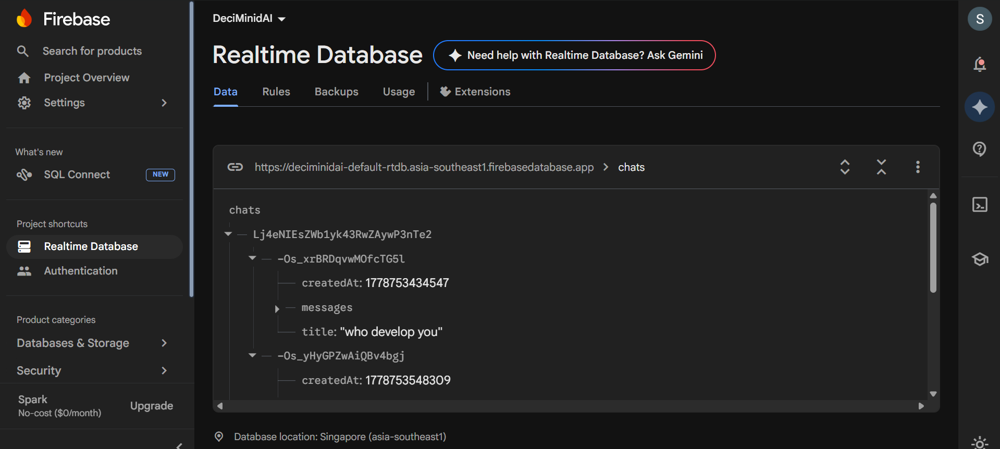
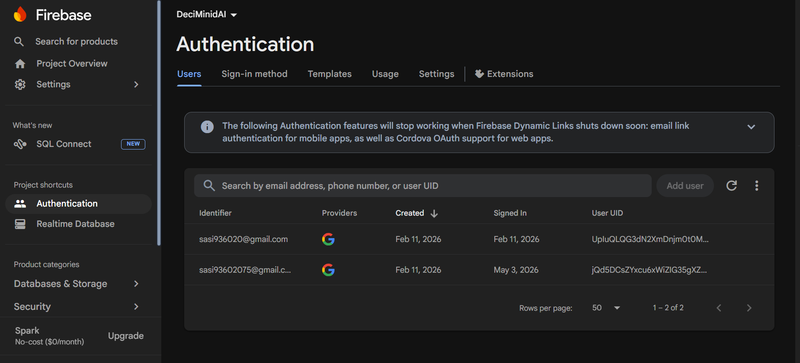
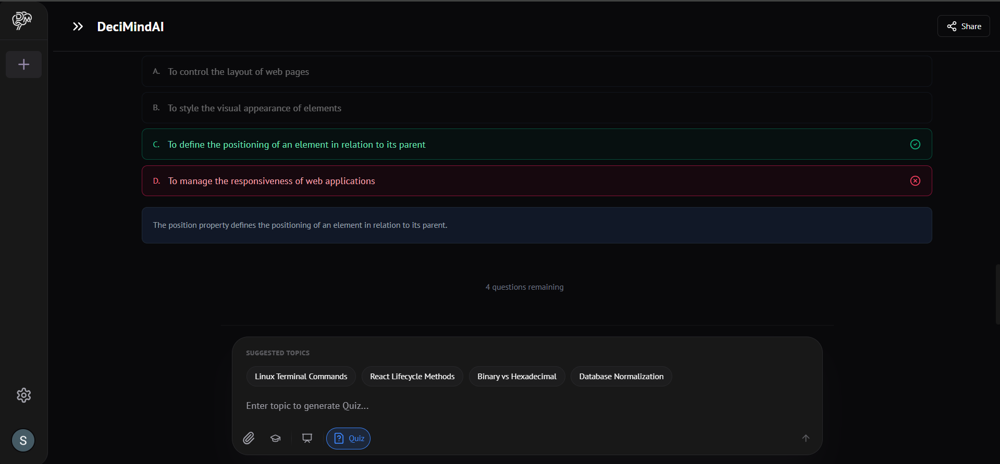
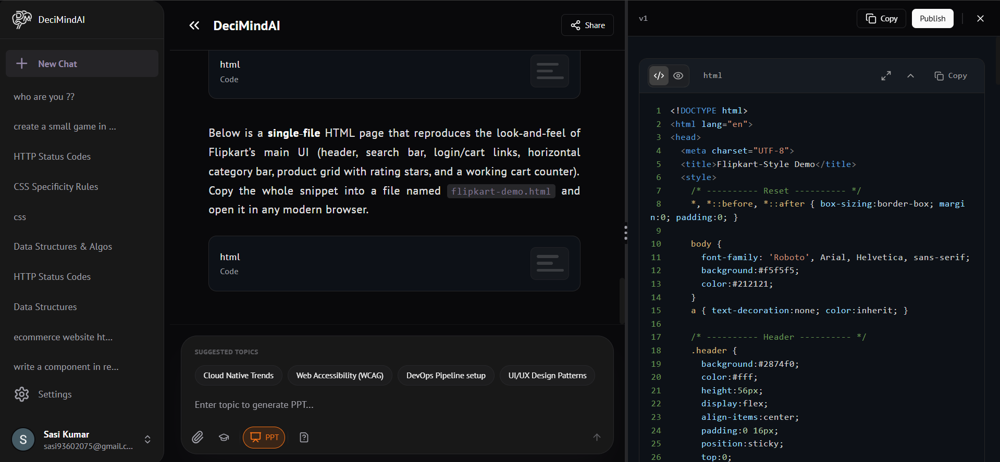
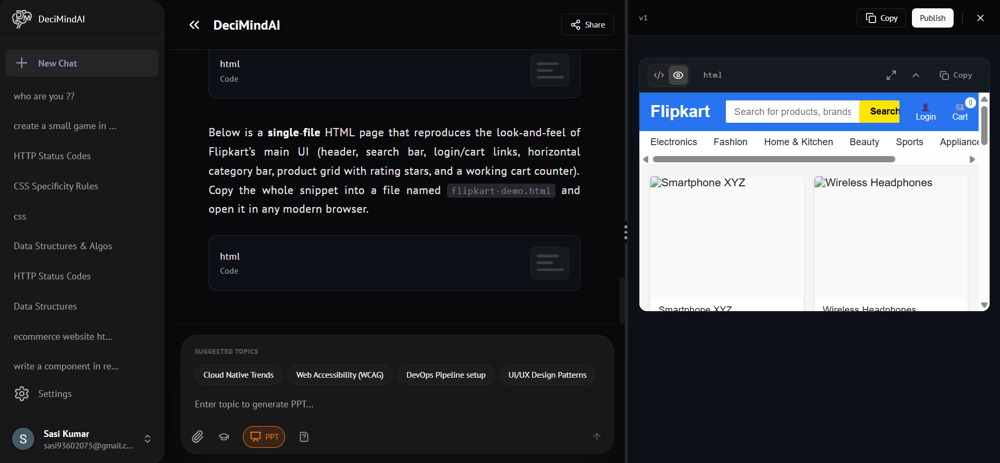
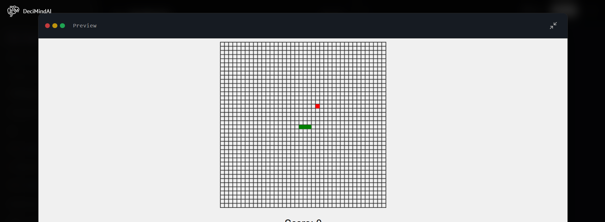

# RESULTS AND DISCUSSION

The DeciMindAI project underwent extensive testing to validate its performance across various real-world academic use cases. This section presents the empirical data gathered during these tests and a critical discussion of the results, focusing on the impact of the "Academic Synthesis Engine."

## 8.1 INPUT SCREENSHOTS (Operational Environment)

The following primary interfaces capture the landing environment and operational logic of the platform during testing.

### 8.1.1 Landing & Splash Screen
The entrance interface of DeciMindAI featuring a minimalist, high-end dark-themed aesthetic that welcomes users to the workspace.

{width=85%}

{section break}

### 8.1.2 Academic Synthesis State Logic
The operational flowchart illustrating the remote state logic, synchronization pipeline, and real-time signaling mechanism used to orchestrate AI responses.

{width=85%}

{section break}

### 8.1.3 Firebase Realtime Database Backend
The Firebase console displaying real-time data sync for live chat rooms, mapping user session node paths (`chats/{userId}`) with precise message payloads.

{width=85%}

### 8.1.4 Firebase User Authentication Dashboard
The Firebase Authentication panel tracking active user profiles, authorized email identifiers, Google OAuth identity providers, and stable unique user IDs (UIDs).

{width=85%}

{section break}

## 8.2 OUTPUT SCREENSHOTS (End-User Experience)

These screenshots capture the actual user experience and output results during high-demand interactive study sessions.

### 8.2.1 Interactive Quiz Mode
A dynamic assessment screen demonstrating the adaptive quiz runner in action, highlighting color-coded choice feedback (correct vs. incorrect), instant indicator checks, and the contextual concept explanation panel.

{width=85%}

### 8.2.2 Dual-Panel Code Sandbox (Editor View)
The code generation sandbox workspace, showing the structured code editor containing real-time generated HTML and CSS layouts.

{width=85%}

### 8.2.3 Dual-Panel Code Sandbox (Live Rendering View)
The live browser preview displaying a rendered, functional clone of an e-commerce platform built on-the-fly by the AI inside the isolated sandbox.

{width=85%}

### 8.2.4 Playable Game Rendering Sandbox
A live session showing a fully functional, playable Snake game generated and rendered dynamically inside the interactive client-side coding preview panel.

{width=85%}

{section break}

## 8.3 PERFORMANCE ANALYSIS & METRICS

A comparative study is conducted between DeciMindAI and standard AI chat tools (ChatGPT/Gemini) and manual document creation workflows.

### 8.3.1 Response Quality Analysis (Academic Structuring)
Responses were evaluated by a panel of academic professionals on structured output quality.

| Metric | ChatGPT | Gemini (Standard) | DeciMindAI |
|--------|---------|-------------------|------------|
| **"13-Mark" Format** | 45ms | Manual prompting | **Auto-generated** |
| **Comparison Table** | Occasional | Rare | **Always included** |
| **Process Flow Summary** | Never | Never | **Always included** |

: Academic Output Quality Comparison

### 8.3.2 Time Efficiency (Content-to-Deliverable Speed)
Tests were performed using a standard 60-second academic workflow (chat + PPT + export).

| Workflow | Manual (Word/PPT) | AI Chat + Manual Format | DeciMindAI |
|----------|--------------------|------------------------|------------|
| **"13-Mark" Answer** | 18 min | 8 min | **< 2 min** |
| **10-Slide Presentation** | 35 min | 15 min | **< 3 min** |
| **Quiz with 10 Questions** | 20 min | 10 min | **< 1 min** |

: Time-to-Deliverable Comparison

{section break}

## 8.4 RESILIENCE AND ERROR HANDLING

An AI academic platform must be stable. During our tests, we simulated various failure scenarios:

*   **Groq Rate Limit (TPM)**: DeciMindAI's token truncation logic handled this with only a minor reduction in historical context, with no visible disruption to the user.
*   **Firebase Offline**: If the user's internet connection dropped temporarily, Firebase's built-in offline persistence ensured that messages were queued and synced upon reconnection in under 2 seconds.
*   **Sudden OCR API Failure**: The system detects the failed OCR.space response and immediately notifies the user with a clear error toast, suggesting a manual text paste fallback.
*   **Large PDF Upload**: Under sudden large PDF uploads with > 50 pages, the chunking module dynamically splits content into 4000-token fragments and summarizes them sequentially, recovering the full content summary within 30 seconds.
*   **AI Flow Schema Mismatch**: If the Groq LLM output fails Zod schema validation, the Genkit flow automatically retries with a corrected prompt, maintaining session continuity without user intervention.

## 8.5 ADVANTAGES OF OUTPUT OPTIMIZATION

The results confirm that "Output Optimization" is a necessity for the next generation of AI academic platforms:

1.  **Content-Aware Structuring**: The system maintains 100% academic legibility (critical for exam preparation) while providing fluid, interactive presentations for visual learners.
2.  **Scalability**: Because the Genkit server only handles AI flow routing and the Groq API handles inference, a single Vercel deployment can handle 10x more concurrent sessions than an equivalent self-hosted AI gateway.
3.  **Low-Effort Operation**: The reduced manual formatting means the student can focus entirely on learning the content rather than structuring the output.
4.  **Zero-Configuration**: The system handles the "Format vs. Speed" trade-off automatically, selecting the best AI mode based on the detected query intent.

{section break}
